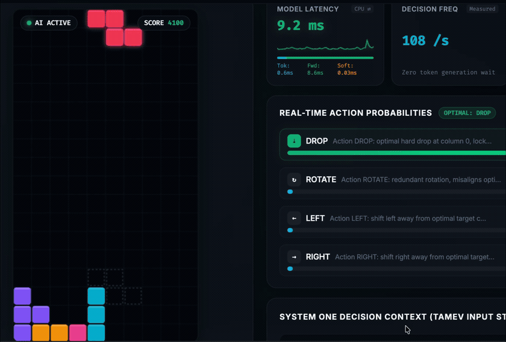

# ⚡ TAMEV — Tiny, Fast Decision Models for CPU & Edge

**Open-source `Jev` alternative and `Kev` alternative: lightweight, permutation-invariant System One decision models. A state plus typed questions in, calibrated probabilities out — in milliseconds, on commodity CPU, no GPU required.**


-orange.svg)

-blue.svg)

[](https://huggingface.co/Tamkimd)
[](LICENSE)

<p align="center"></p>

## 💡 Why TAMEV

Generative LLMs are System Two: autoregressive, priced per token, and free to emit invalid JSON. When a workflow needs an immediate **typed decision** — routing a request, gating a tool call, screening for safety — generating prose is waste.

- 🎯 **Typed answers, not prose** — `choice`, `noul` (probabilistic boolean) and `score` (ordinal) answered together in one forward pass. Nothing to parse, nothing to repair.
- 🔒 **Zero permutation bias by construction** — context and every option are encoded independently and scored with a symmetric bilinear head, so reordering your candidate list permutes the scores instead of changing them.
- ⚡ **Millisecond CPU inference** — 5.33 ms p50 (Micro) and 10.68 ms p50 (Nano) on one thread of a commodity CPU. No accelerator, no per-token fee.
- 📦 **Small and portable** — 14M / 23M / 149M parameters, 9 export targets (ONNX FP32/INT8, Core ML, MLX, Metal MPS, TorchScript, PyTorch FP32/BF16/INT8), Apache-2.0, self-hosted and offline.

## 🚀 Quick Start

```bash
uv pip install -e ".[dev]"   # from a source checkout; no PyPI release yet
```

```python
from transformers import AutoModel, AutoTokenizer

model_id = "Tamkimd/tamev-nano-tinybert"
tokenizer = AutoTokenizer.from_pretrained(model_id, trust_remote_code=True)
model = AutoModel.from_pretrained(model_id, trust_remote_code=True)

decision = model.predict_decision(
    state="Customer in Tokyo reports Visa debit blocked after ATM withdrawal attempt.",
    question="Which service queue should handle this incident?",
    options=[
        "Verify identity and lift geographic travel block",
        "Open unauthorized transaction fraud dispute",
        "Direct customer to visit physical branch",
    ],
    tokenizer=tokenizer,
)
print(decision["best_option"], decision["confidence"], decision["probabilities"])
```

Or run the server and call `/v1/systemone` (TypeSafe-compatible shape):

```bash
uv run tamev serve --checkpoint Tamkimd/tamev-nano-tinybert --port 8008
```

## 🏆 Models

Three recommended tiers, on [Hugging Face Hub](https://huggingface.co/Tamkimd) under Apache 2.0, ready for `from_pretrained`, each exported to all 9 runtimes.

| Tier | Repository | Backbone | Params | p50 (CPU) | Top-1 | Top-3 | ECE | Drift |
| :--- | :--- | :--- | :---: | :---: | :---: | :---: | :---: | :---: |
| **Nano** | [`tamev-nano-tinybert`](https://huggingface.co/Tamkimd/tamev-nano-tinybert) | TinyBERT-4L/312D | **14.39M** | **10.68 ms** | **73.2%** | **92.8%** | **0.013** | **0.0** |
| **Micro** | [`tamev-micro-minilm`](https://huggingface.co/Tamkimd/tamev-micro-minilm) | all-MiniLM-L6-v2 | **22.76M** | **5.33 ms** | **78.7%** | **97.3%** | **0.025** | **0.0** |
| **Small** | [`tamev-small-modernbert`](https://huggingface.co/Tamkimd/tamev-small-modernbert) | gte-ModernBERT-base | **149.41M** | **32.72 ms** | **84.0%** | **99.0%** | **0.037** | **0.0** |

Scored on a 19,999-item held-out decision suite (Banking77, BoolQ, AG News, MultiNLI, SST-5, Yelp, TREC, DBpedia-14, Amazon Reviews, IMDb, plus synthetic policy records), full option set per item, single-threaded CPU. Latency is the `predict_decision` path on one machine — a reference point, not an SLA. Calibrated probabilities carry the checkpoint temperature; raw `forward()` logits do not. Wide option sets (K ≫ 8) are the weakest axis: fine-tune on your own distribution.

**Medium and Large** (Qwen3.5-0.8B and 4B backbones with a trained pointer head) are work in progress — no benchmark numbers published, not recommended for production yet. Nano / Micro / Small are what we stand behind.

## 🥊 TAMEV vs. Kev vs. Jev vs. Laya vs. SemIf

| Metric | **TAMEV-Nano** | **TAMEV-Micro** | **TAMEV-Small** | **Kev-0.8B** [1] | **Kev-4B** [1] | **Laya** [2] | **Jev** [3] |
| :--- | :---: | :---: | :---: | :---: | :---: | :---: | :---: |
| **Architecture** | Decoupled bi-encoder | Decoupled bi-encoder | Decoupled bi-encoder | Causal + LoRA | Causal + LoRA | Non-autoregressive | Hosted (closed) |
| **Permutation drift** | **exactly 0.0** | **exactly 0.0** | **exactly 0.0** | Order-sensitive | Order-sensitive | Not published | Not published |
| **Latency p50** | **10.68 ms CPU** | **5.33 ms CPU** | **32.72 ms CPU** | 149 ms (M5 MLX) | 721 ms (M5 MLX) | 33.0 ms (T4 GPU) | Not published |
| **Top-1** | **73.2%** | **78.7%** | **84.0%** | 64.8% dev | 81.7% dev | 76.6% fine-tuned | 85.7% |
| **Deployment** | In-process, HTTP, ONNX, Core ML, MLX, MPS, TorchScript | same | same | MLX, MPS, CUDA | MLX, MPS, CUDA | HTTP, ONNX | Cloud API only |

- **vs Kev** — Kev documents that changing option order can change an answer; TAMEV's order invariance is structural, measured drift **0.0** and flip rate **0.00%**.
- **vs Jev** — Jev is hosted and closed: no downloadable weights, no offline path. TAMEV is Apache-2.0 weights you own and run, down to a Raspberry Pi-class ARM CPU.
- **vs Laya** — Laya is a server-GPU engine (33 ms/question on a T4); TAMEV-Micro answers in 5.33 ms on one CPU thread.
- **vs SemIf** — SemIf reads typed probabilities out of an underlying LLM; TAMEV adds a trained pointer head, per-`K` calibration and standalone export artifacts.

*[1] Kev, [2] Laya and [3] Jev numbers are quoted from each project's own published material and **not re-measured here**; every project evaluates on its own benchmark, so compare architecture and deployment shape rather than the accuracy columns.*

## 🌍 Export & deploy

```bash
uv run tamev export --model Tamkimd/tamev-nano-tinybert --formats onnx_int8,coreml,mlx --out models/exported/nano
```

| Format | Runtime | Target |
| :--- | :--- | :--- |
| `onnx_int8` / `onnx_fp32` | ONNX Runtime | ARM64/x86 edge CPUs, containers (31.4 / 54.7 MiB) |
| `pytorch_mps` | Metal MPS FP16 | Apple Silicon GPU (27.5 MiB) |
| `mlx` | Apple MLX | Apple Silicon unified memory (54.9 MiB) |
| `torchscript` | C++ LibTorch | embedded / robotics (55.1 MiB) |
| `pytorch_fp32` / `bf16` / `int8` | PyTorch eager | prototyping, server CPU |
| `coreml` | Apple Core ML | iOS / macOS / Neural Engine |

Only the CPU and Apple Silicon MPS paths are benchmarked here; the Core ML export needs the `.[coreml]` extra.

## 🛠️ Fine-tune on your own decisions

```bash
uv run tamev finetune --data my_decisions.jsonl --tier micro --epochs 3 --formats onnx_int8,coreml,mps,mlx
```

Filters, splits, trains a composite proper-scoring loss, fits temperature post-hoc and exports in one command. Backbones and teachers are swappable (TinyBERT, MiniLM, ModernBERT, Qwen3.5, distilled from an agent, a local Qwen3.5-4B or an OpenAI-compatible endpoint). Presets: [`configs/nano.yaml`](configs/nano.yaml), [`configs/micro.yaml`](configs/micro.yaml), [`configs/small_ordtext_mixed_mps.yaml`](configs/small_ordtext_mixed_mps.yaml), [`configs/medium_qwen35_08b.yaml`](configs/medium_qwen35_08b.yaml), [`configs/large_qwen35_4b.yaml`](configs/large_qwen35_4b.yaml).

## 🧭 GitHub ↔ Hugging Face

| | This repository | [Hugging Face Hub](https://huggingface.co/Tamkimd) |
|---|---|---|
| **Owns** | source, architecture, training, configs, tests, export pipeline, `/v1/systemone` server | weights, cards, tokenizer files, deployment artifacts |
| **Never contains** | weights, checkpoints, training corpora, local ops logs | this repo's git history or training code |

The code each Hub repo serves is generated from [`decision_engine/export/hf_templates/`](decision_engine/export/hf_templates/), so the Hub's inference path and this implementation are the same code. Training corpora and the held-out suite are **not distributed** — supply your own JSONL ([schema](decision_engine/data/schema.py)) or fine-tune from the Hub weights. [`data/processed/test.jsonl`](data/processed/test.jsonl) (896 items) is committed so `tamev benchmark` runs out of the box.

## 🧪 Tests & License

```bash
uv run pytest tests/ -q
```

[Apache License 2.0](LICENSE) · Copyright © 2026 TAMEV Authors & Contributors. See [CONTRIBUTING.md](CONTRIBUTING.md) and [SECURITY.md](SECURITY.md).

**Topics:** `jev` · `jev-alternative` · `kev-alternative` · `decision-model` · `decision-engine` · `system-one` · `typesafe` · `typed-decisions` · `permutation-invariant` · `llm-routing` · `tool-calling` · `edge-ai` · `on-device` · `cpu-inference` · `small-language-models` · `knowledge-distillation` · `calibration` · `onnx` · `coreml` · `mlx`
